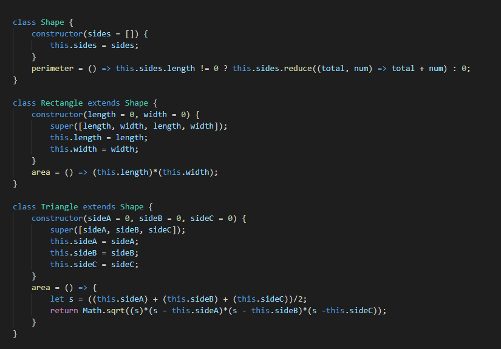
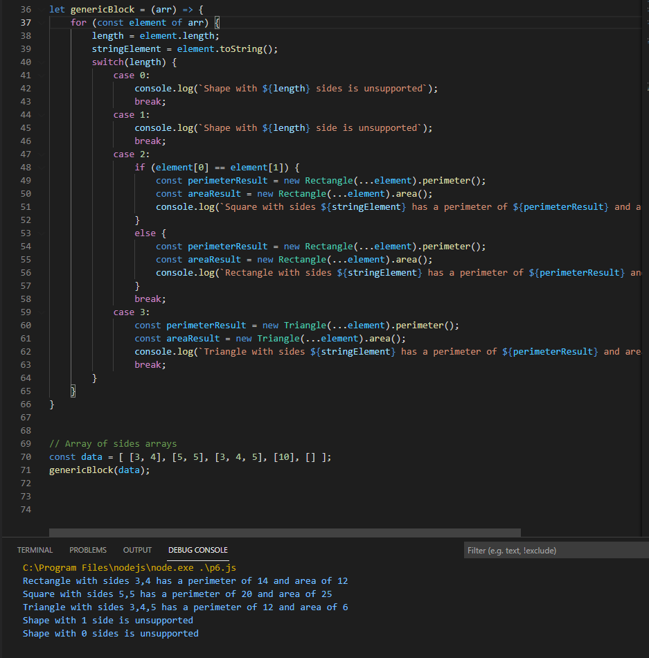

# Welcome to the Cit 281 Project 6 Page

### What I learned:

- Gained experience creating and working classes with inheritance.
- Gained more experience creating and working with classes.
- Gained more experience interpreting functional descriptions and specifications to complete an assignment.

### Purpose of Project:

- This was our first required project working with classes, as well as introducing us to class inheritence.
- I worked with different classes and having an outside block of code utilize these classes.
- I gained more experience with arrays, as well an array containing a list of arrays and having code that work with that.

### Outcome pics: 

### [**Back to home page**](https://uo-cit-itsbread33.github.io/ItsBread33.github.io/)
